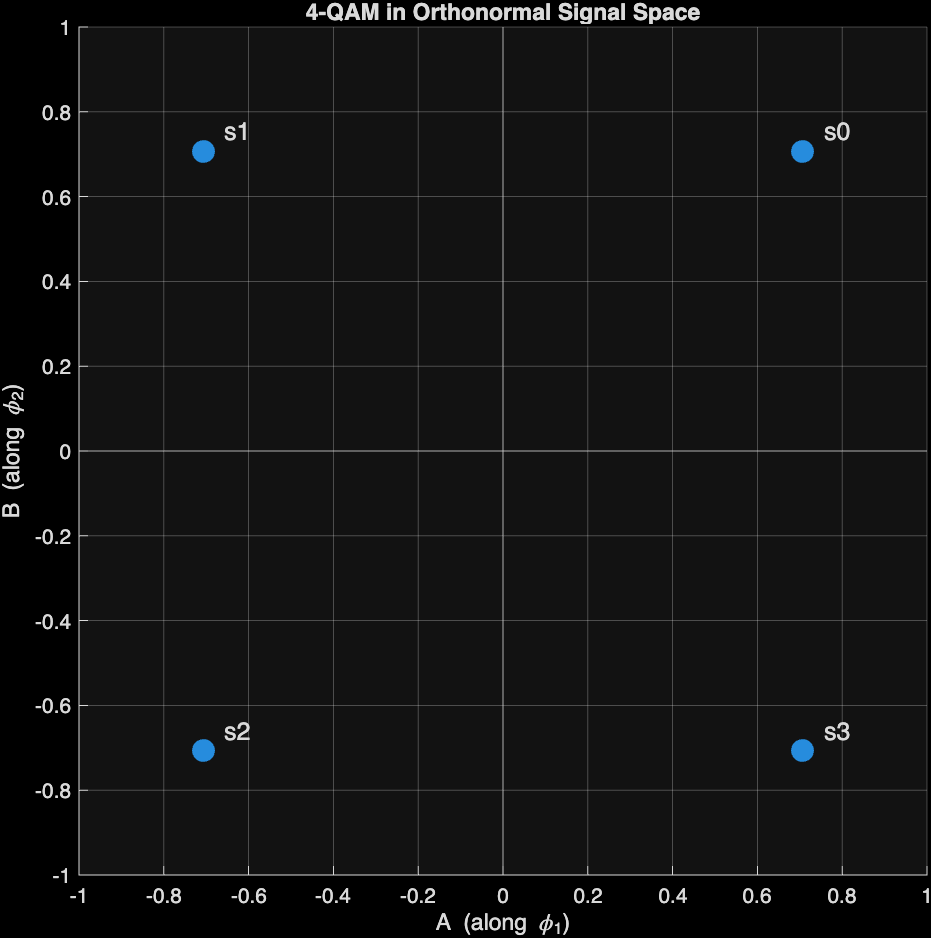
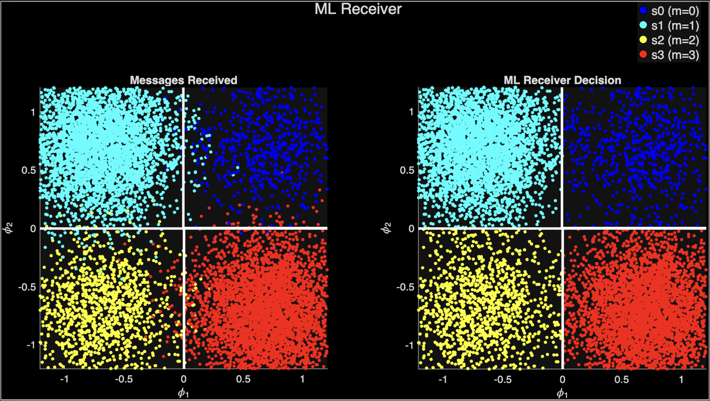
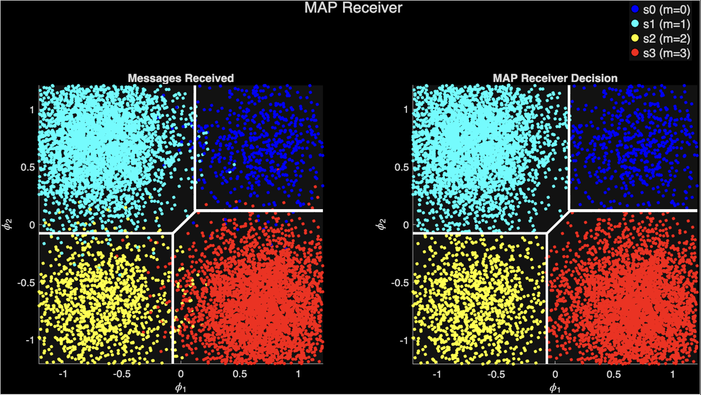
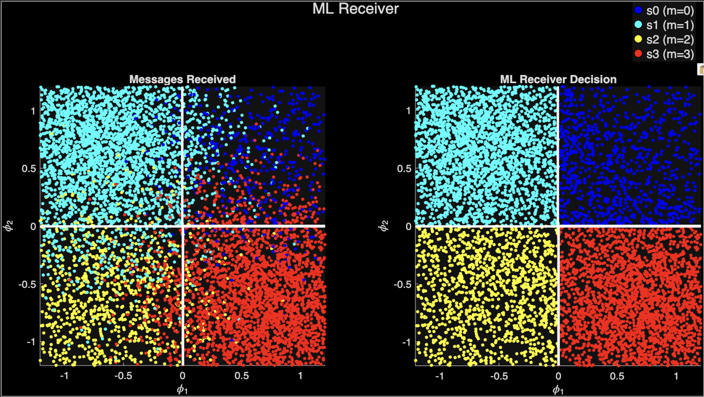
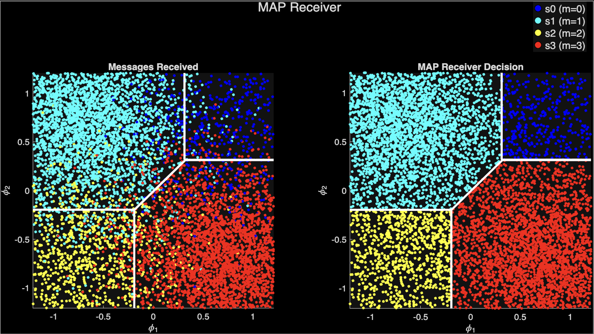
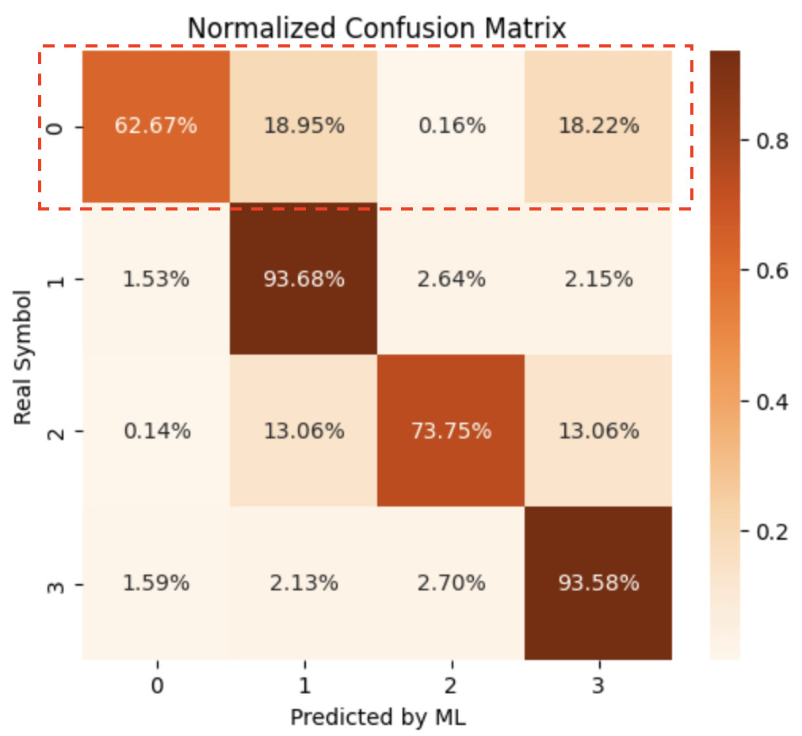

# map-ml-detector-benchmark
This project explores whether a simple machine learning classifier (Logistic Regression) can learn to perform symbol detection compared to classical MAP and ML detectors.

## 1. Simulation Setup
This section describes the simulation setup, including the modulation scheme, prior distribution of messages, channel model, and sample generation for training and testing.

### Modulation Scheme
---
We consider a simple **4-QAM modulation scheme**, where the symbols are represented as complex numbers in the constellation diagram. The symbols are:

| Symbol | $A_l$             | $B_l$             |
|--------|-------------------|-------------------|
| $S_0$  | $1/\sqrt{2T_s}$   | $1/\sqrt{2T_s}$   |
| $S_1$  | $-1/\sqrt{2T_s}$  | $1/\sqrt{2T_s}$   |
| $S_2$  | $-1/\sqrt{2T_s}$  | $-1/\sqrt{2T_s}$  |
| $S_3$  | $1/\sqrt{2T_s}$   | $-1/\sqrt{2T_s}$  |


#### Constellation Diagram


### Prior Distribution of Messages
---
We assume that the messages are equally likely, i.e., the prior probabilities for each symbol are:
- P($s_0$) = 1/15
- P($s_1$) = 6/15
- P($s_2$) = 2/15
- P($s_3$) = 6/15

### Gaussian channel and Noise Model
---
The transmitted symbols pass through an **Additive White Gaussian Noise (AWGN) channel** where the spectral density of the noise is given by $N_0/2$. 

$r = s + n,\quad \text{where }
n \sim N(0, N_0/2)$

#### SNR Ranges
>$N_0$($E_s=1$)  | SNR(linear)  | SNR(dB)       | Channel Type
>----------------|--------------|---------------|--------------
>0.05 - 0.02     | 20 - 50      | 13.98 - 17.00 | Excellent
>0.10 - 0.05     | 10 - 20      | 10.00 - 13.98 | Good
>0.20 - 0.10     | 5 - 10       | 7.00 - 10.00  | Medium
>0.50 - 0.20     | 2 - 5        | 3.01 - 7.00   | Poor
>2.00 - 0.50     | 0.5 - 2      | -3.01 - 3.01  | Very Bad

### Sample Generation for Training and Testing
---
We generate a dataset from range of N0 values corresponding to different SNR levels. The N0 Range are as follows: 
```
list_N0 = linspace(0.05, 0.95, 19);
```

with every N0 value, we generate 10000 samples for training and 10000 samples for testing. Each sample consists of a transmitted symbol and the corresponding received symbol after passing through the AWGN channel.

## 2. ML vs MAP Receivers
This section describes the result of implementation Maximum Likelihood (ML) and Maximum A Posteriori (MAP) receivers for symbol detection.


### Medium Channel (SNR: 10dB)
>Symbol Error Probability ML : 0.0240
>

>Symbol Error Probability MAP : 0.0175
>

### Poor Channel (SNR: 3dB)
>Symbol Error Probability ML : 0.1551
>

>Symbol Error Probability MAP : 0.1180
>


MAP receiver outperforms ML receiver due to the non-uniform prior distribution of messages especially in low SNR scenarios.


## 3. Machine Learning Classifier
This section describes the implementation of a Logistic Regression classifier for symbol detection and compares its performance with MAP and ML receivers.



## How to read
### Example look at Real Symbol = 0 (x-axis)
Predicted by ML Classifier (y-axis):
- 0 (62.67%) ==> Correct classification 63% of the time
- 1 (18.95%) ==> Misclassified as symbol 1 18.95%
- 2 (0.16%)  ==> Misclassified as symbol 2 0.16%
- 3 (18.22%) ==> Misclassified as symbol 3 18.22%

> So symbol 0 is mostly confused with symbol 1 and symbol 3.

## ML vs MAP vs ML Classifier
with Logistic Regression Classifier implemented using sklearn library, we compare the performance of all three detectors across different SNR levels.


ML MAP and ML Classifier have similar performance at high SNR levels, but as the SNR decreases, the ML Classifier starts to outperform the ML detector and approaches the performance of the MAP detector. ML Classifier has the similar performance as MAP detector at low SNR but of course MAP detector is still the best performer overall.